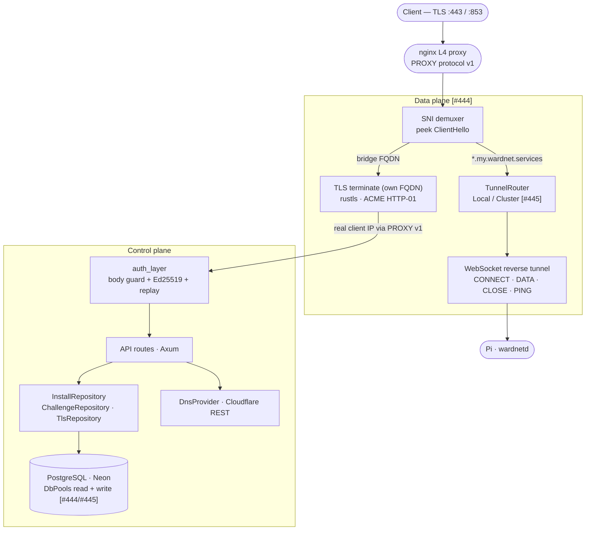

# wardnet-bridge

Per-region service for wardnet installations. It has two planes:

- **Control plane** — DDNS registration, IP updates, ACME DNS-01 credential proxying, and installation lifecycle. *(Live.)*
- **Data plane** — an SNI demuxer that **terminates TLS for the bridge's own FQDN** (serving the control-plane API) and **passes through** every other SNI on `:443` (HTTPS) and `:853` (Android Private DNS / DoT) over a per-install **WebSocket reverse tunnel**, so a Pi behind CGNAT is reachable without inbound ports and its TLS private key never leaves the Pi. *([#444].)*

It runs on a public VM in each region behind a **transparent L4 proxy** (nginx + PROXY protocol v1) that maps the public privileged ports to the bridge's localhost ports. The bridge issues and renews its **own** certificate via ACME HTTP-01 — there is no Caddy (see [adr-bridge-self-terminated-tls.md](../../docs/adr-bridge-self-terminated-tls.md)).

> ## Status
> This document describes the **agreed target architecture**; delivery is staged, so items below are tagged with the issue that lands them:
> - **Live on `main`:** the control plane (register / update-IP / ACME / deregister).
> - **`[#444]` (in review):** SNI demuxer (`:443`/`:853`) + WebSocket reverse-tunnel relay; database migration off SQLite.
> - **`[#445]` (planned):** PostgreSQL on managed Neon; a runtime `SecretsProvider` trait (Infisical-backed); multi-node `TunnelRouter`/`ClusterRouter` routing; Ed25519 challenge-response on the tunnel upgrade.
>
> Anything tagged `[#444]`/`[#445]` is not yet on `main`.

## Overview

Pi devices talk to the bridge to:

1. **Register** — claim a subdomain slug, prove ownership of an Ed25519 key-pair, and receive a bearer token.
2. **Update IP** — push their current public IPv4; the bridge upserts a Cloudflare A record for `<slug>.my.wardnet.services`.
3. **Provision ACME** — store and delete the Cloudflare TXT record needed for DNS-01 Let's Encrypt certificate issuance.
4. **Deregister** — delete the installation and its Cloudflare records.
5. **Open a tunnel** `[#444]` — dial a persistent WebSocket (`GET /v1/installs/:id/tunnel`) that the bridge uses to relay inbound `:443`/`:853` streams down to the Pi. For **tenant** traffic the bridge never terminates TLS — it peeks the SNI, routes, and splices the raw stream. It terminates TLS only for its **own** FQDN (the control-plane API).

## Security model

| Mechanism | Detail |
|---|---|
| **Registration PoW** | SHA-256(nonce‖name‖pubkey‖proof) must have ≥ 24 leading zero bits. Prevents sybil registration. (One layer among several — not a strong barrier on its own.) |
| **Bearer token** | 32 random bytes returned once at registration. The bridge stores only `SHA-256(token)`. |
| **Ed25519 request signing** | Every authenticated request is signed over `"METHOD\npath_and_query\ntimestamp\nhex-sha256(body)"`. |
| **Tunnel establishment** `[#445]` | The `GET /v1/installs/:id/tunnel` upgrade requires an Ed25519 **server-nonce challenge-response** signed by the install's registered key — *not* the bearer token alone. An unauthenticated tunnel claim would allow full traffic hijack of that install. |
| **Replay protection** | Signed requests include a Unix timestamp (±60 s window); `(install_id, timestamp, body_hash)` tuples are cached in `ReplayCache` for 120 s. |
| **IP binding** | PoW challenges are IP-bound; a different client IP cannot redeem a challenge issued to another address. |
| **Body size guard** | All requests are buffered to 1 MiB max before any auth check — prevents memory exhaustion on unauthenticated endpoints. |
| **Path gate** | DB token lookup is only attempted for `/v1/installs/*` paths, blocking a DoS vector where an attacker forces DB queries on public endpoints. |
| **Rate limiting** | 20 challenges / IP / hour; 3 registrations / IP / 24 h. |
| **Reserved IP filter** | `PUT /v1/installs/:id/ip` rejects RFC 1918, loopback, link-local, and documentation-range addresses. |
| **Trusted proxy** | The bridge runs behind a transparent L4 proxy (nginx + PROXY protocol v1); it consumes the PROXY header to recover the **real client IP** and threads it in as `ConnectInfo`, which the per-IP rate limit and IP-bound PoW key off. `X-Forwarded-For` is trusted only for loopback peers (dev/tests). |

## Architecture



`AppState` is a cheap `Arc`-clone carrying:
- `Config` — non-secret config from the environment at startup
- `Arc<dyn SecretsProvider>` `[#445]` — runtime secret fetch (see Secrets)
- `Arc<dyn InstallRepository>` / `Arc<dyn ChallengeRepository>` — Postgres or mock
- `Arc<dyn DnsProvider>` — Cloudflare REST or mock
- `Arc<ReplayCache>` — in-process replay window
- `Arc<dyn TunnelRouter>` `[#444/#445]` — inbound-stream routing (see Multi-node)

## Multi-node `[#445]`

Inbound streams are routed through a `TunnelRouter` trait so the SNI demuxer and the tunnel framing never change as the topology grows:

- `LocalRouter` — looks the install up in this node's in-memory `TunnelRegistry`; splice on hit, drop on miss. Correct for a single node.
- `ClusterRouter` — on a local miss, resolves the **owning node** via a `tunnel_routes` table and forwards the raw stream over the private network to that node, which splices it as if local.

Because any node can reach any install this way, **LB source-IP sticky sessions are not required** — the load balancer can be plain round-robin. A single node simply runs `ClusterRouter` with a one-row ownership table.

## API surface

| Method | Path | Auth | Description |
|--------|------|------|-------------|
| `GET` | `/health` | — | Liveness probe |
| `GET` | `/v1/register/challenge` | — | Issue a PoW challenge (rate-limited) |
| `POST` | `/v1/register` | — | Register a new installation |
| `GET` | `/v1/names/:name/available` | — | Check subdomain availability |
| `PUT` | `/v1/installs/:id/ip` | Bearer + Ed25519 | Update public IP / upsert A record |
| `POST` | `/v1/installs/:id/acme` | Bearer + Ed25519 | Provision ACME TXT record |
| `DELETE` | `/v1/installs/:id/acme` | Bearer + Ed25519 | Remove ACME TXT record |
| `DELETE` | `/v1/installs/:id` | Bearer + Ed25519 | Deregister installation |
| `GET` | `/v1/installs/:id/tunnel` `[#444/#445]` | Ed25519 challenge-response | Upgrade to the WebSocket reverse tunnel |

An OpenAPI document is generated at build time via `utoipa` and `utoipa-axum`.

## Secrets `[#445]`

Production secrets are **fetched at runtime through a `SecretsProvider` trait into process memory** — never read from the environment and never written to disk:

- Production impl: **Infisical**, bootstrapped by a single-use, response-wrapped token delivered by the infrastructure tooling (the only credential on the node; cache any session token on tmpfs).
- Dev/test impl: `FileSecrets` / `EnvSecrets` with dummy values.

`config.rs` resolves `DATABASE_URL`, the Cloudflare token, etc. via the provider at startup. See the infrastructure repo (`wardnet/wardnet-infrastructure`) for how secrets are provisioned (GitHub-sourced → reconciled into Infisical).

## Database

PostgreSQL — **managed Neon in production** `[#444/#445]`. `DbPools { read, write }` keeps a two-field struct; both point at one pool until a read-replica split is warranted, so repository call sites don't change. Migrations live in `migrations/` (sqlx-migrate).

**Neon serverless pool rules** (stay within the free CU-hour budget): `min_connections = 0` so the pool drains and Neon can autosuspend (a held idle connection pins compute awake), a sane idle timeout, and graceful reconnect on cold start. DDNS IP updates write **only when the value changes**, so an idle install lets the DB sleep.

*(History: the bridge began on SQLite + WAL; #444 migrated the schema off SQLite and #445 settles on PostgreSQL/Neon.)*

## Configuration

Non-secret configuration is read from the environment at startup; **secrets are resolved via the `SecretsProvider`** (above), not the environment, in production.

The deployment identity is injected by the inforge bootstrapper as `INFORGE_DEPLOYMENT_*` variables.

| Variable | Required | Default | Description |
|---|---|---|---|
| `INFORGE_DEPLOYMENT_FQDN` | ✓ | — | The bridge's **own** FQDN, e.g. `bridge.svc.prod.use1.wardnet.network`. TLS for this SNI is terminated locally; the cert is issued via ACME HTTP-01 |
| `INFORGE_DEPLOYMENT_REGION_SLUG` | ✓ | — | Short region slug, e.g. `"use1"` (→ `region`) |
| `INFORGE_DEPLOYMENT_ENVIRONMENT` | — | `staging` | `prod` ⇒ Let's Encrypt production directory; anything else ⇒ LE staging |
| `SUBDOMAIN_PARENT` | ✓ | — | Tenant DNS parent (region-free), e.g. `"my.wardnet.services"` |
| `ENCRYPTION_KEY` | ✓ | — | base64 of a 32-byte AES-256-GCM key for sealing cert/account material at rest; **identical across hosts in a region** |
| `HTTP01_LISTEN_ADDR` / `TLS_LISTEN_ADDR` / `DOT_LISTEN_ADDR` | — | `127.0.0.1:8080` / `:8443` / `:8853` | Loopback binds; public `:80`/`:443`/`:853` reach them via the L4 proxy |
| `DATABASE_URL`, `CLOUDFLARE_API_TOKEN`, `CLOUDFLARE_ZONE_ID` | ✓ | — | Resolved via `SecretsProvider` in prod; env/`FileSecrets` in dev |
| `GLOBAL_DATABASE_URL` | ✓ | — | DSN for the **global naming authority** (separate global Postgres holding the `names` table; shared fleet-wide, distinct from the regional `DATABASE_URL`) |

## Building and running

The bridge has no Linux-specific dependencies, so it builds natively on macOS for development:

```sh
# From repo root
make check-bridge   # clippy -D warnings + tests
make build-bridge   # release binary
```

Repository/integration tests run against a live Postgres started via `docker compose up -d` before running the tests. For a local smoke run, point `DATABASE_URL` at a local or Neon dev database and use `FileSecrets`/env for the Cloudflare values.

## Releasing and deploying

The bridge releases **independently of the daemon**. Its version source of truth
is the `version` in [`Cargo.toml`](Cargo.toml) (pure SemVer), and its release tag
prefix is **`bridge-v*`** — never the daemon's `v*.*.*` CalVer tags.

To cut a release:

```sh
# 1. bump source/Cargo.toml `version` (e.g. 0.1.0 -> 0.1.1), commit
# 2. tag and push — the tag MUST equal Cargo.toml's version, prefixed `bridge-v`
git tag bridge-v0.1.1
git push origin bridge-v0.1.1
```

Pushing the tag runs two workflows in sequence:

1. **`.github/workflows/release-bridge.yml`** — builds the aarch64 binary,
   repackages it with the inforge [`deploy/run`](deploy/run) entrypoint into
   `wardnet-bridge-<version>-aarch64.tar.gz`, minisign-signs it (+ `.sha256`,
   SLSA provenance), and publishes a GitHub Release on the `bridge-v*` tag.
2. **`.github/workflows/deploy-bridge.yml`** — triggers the inforge
   `deploy-raw-service` workflow on `wardnet-infrastructure` (passing the release
   tarball URL + the build commit SHA) and **blocks until that deploy finishes**,
   failing the release if it fails. The deploy SSH key lives only in the infra
   repo; this side authenticates with a short-lived bot-app token.

The deploy tarball's root holds `run` + `wardnet-bridge`; inforge runs `run` as
the systemd unit's `ExecStart`. The bridge takes no arguments and reads all
config from the environment (`Config::from_env`), so `run` just execs the binary.

To **re-deploy** an already-published tag (e.g. after an infra-side fix), run the
**Deploy Bridge** workflow manually from the Actions UI with the tag — it is
`workflow_dispatch`-able and idempotent.

`workflow_dispatch`-ing **Release Bridge** on a non-tag ref is a dry run: it
builds and signs but neither publishes nor deploys.

## Crate layout

```
source/
├── src/
│   ├── main.rs          — entry point; config + secrets + pool init; serve API + SNI demuxer
│   ├── config.rs        — non-secret Config; secret resolution via SecretsProvider [#445]
│   ├── state.rs         — AppState (Arc<Inner>)
│   ├── error.rs         — ApiError → HTTP status + JSON
│   ├── replay_cache.rs  — in-process replay window
│   ├── db/              — DbPools (read + write PgPool), init() + migrations
│   ├── secrets/         — SecretsProvider trait + Infisical / File impls   [#445]
│   ├── repository/      — Install / Challenge repositories + traits
│   ├── auth/            — auth_layer (body guard + Ed25519 + replay), AuthenticatedInstall
│   ├── dns/             — DnsProvider trait + CloudflareDnsProvider
│   ├── sni/             — SNI demuxer (peek ClientHello, route by hostname) [#444]
│   ├── tunnel/          — registry, handler (WS upgrade), router (Local/Cluster) [#444/#445]
│   └── api/             — router assembly, OpenAPI doc, route handlers
├── migrations/          — SQL migration files (sqlx-migrate)
└── Cargo.toml
```
